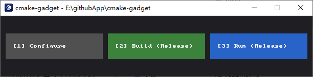

# cmake-gadget

A lightweight C-native GUI tool built with SDL3 to automate the CMake workflow for smaller projects.
**Configure, Build, and Run your Release builds with one click.**

```
+-----------------------------------------------------------------+
| my-project - C:\dev\my-project                              [X] |
+-----------------------------------------------------------------+
|                                                                 |
|  +-----------+     +------------------+     +----------------+  |
|  | [1]       |     | [2]              |     | [3]            |  |
|  | Configure |     | Build (Release)  |     | Run (Release)  |  |
|  +-----------+     +------------------+     +----------------+  |
|                                                                 |
+-----------------------------------------------------------------+
```

## screenshot


## Usage
Place cmake-gadget.exe in your project root.

[1] Configure: Runs cmake -S . -B build.

[2] Build: Triggers a Release build via MSVC/CMake.

[3] Run: Detects and launches your .exe from the Release folder.